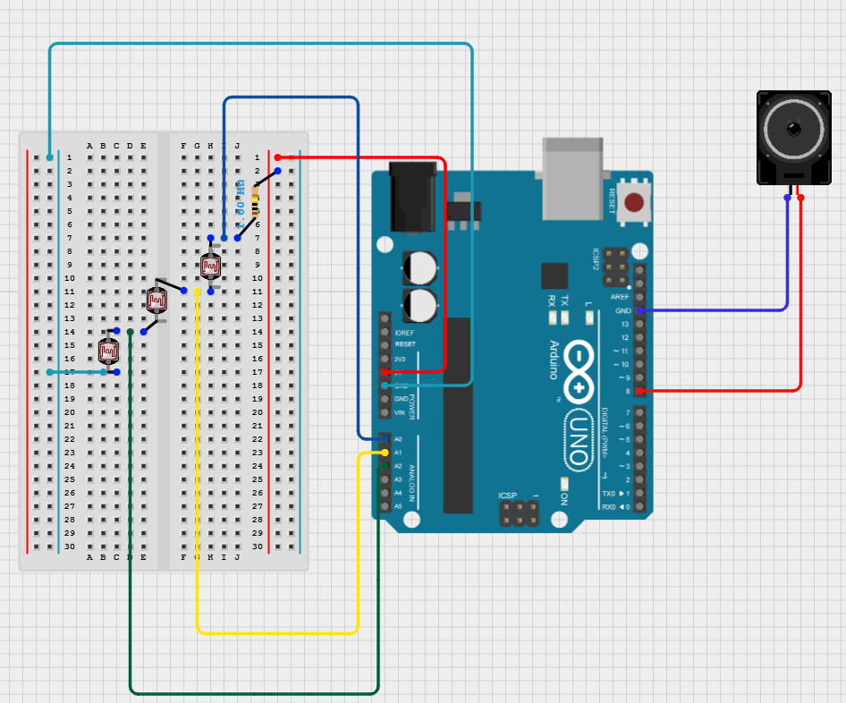

# Optical Theremin

## Introduction

An Optical Theremin is a musical instrument that uses light intensity to control the frequency of sound. The goal of this final project is to mimic this device in Arduino using photoresistors and a digital speaker. We are also interested in analyzing the relationship between light intensity and resistance within a photoresistor.

## Circuit Construction

The main components for this project were:

* Arduino Uno R3 Board (any controller with Analog and Digital pins should work)
* 1M resistor
* 3 LDRs (Photocells)
* Jumper Wires 
* Digital Speaker

Additionally for the light source control we used:

* Arduino Uno R3 Board
* 220 resistors (x3)
* Photodiode
* Jumper Wires

For the in class demonstration of this project, we used two separate Arduino Boards, although with proper engineering it could be possible to do it on one.

For the main functionality with LDRs, the following circuit board diagram was used:

    

## Physics and Equations

3 Analog pins are used to measure the voltage after the resistor, after the first LDR, and after the second LDR, respectively. With this information, we can calculate the voltage over each component in the circuit, which we will note as $V_R, V_1, V_2, V_3$. 

Since the resistance of the resistor is known ($R = 1M$), we can use Ohm's Law to calculate the current in the circuit:
$$
V = IR
$$
$$
I = \frac{V_R}{1\cdot 10^6}
$$

Using this, we can then backtrack and calculate the resistances of each photoresistor $(R_1, R_2, R_3)$ using:
$$
R_i = \frac{V_i}{I} 
$$ 

From the [datasheet](https://yourduino.com/docs/Photoresistor-5516-datasheet.pdf), it tells us that the gamma characteristic of the specific LDR we are working with is:
$$
\gamma = \log \left( \frac{R_{10}}{R_{100}} \right)
$$ 
Where $R_{10}, R_{100}$ are the resistances at 10, and 100 lux respectively. Since we don't have a way of measuring the resistance at a specific lux, we instead calculate the resistance at two voltages, one an order of magnitude higher than the other. 

By doing so we can calculate the gamma characteristic in the Arduino LDRs, and use this to come up with an inverse squared relationship between the light intensity and the resistance of the LDR. 
$$
R = I^{-\gamma}
$$

## Analysis

All data collection for voltage measurements was done within [theremin.ino](https://github.com/akannan05).

Further analysis and graphs were created in Python using numpy and scipy. 

We obtained this plot 

## Device Demonstration

[VIDEO](https://github.com/akannan05)

## Paper

The final paper for this project can be viewed here --> [Link](https://github.com/akannan05)

The in class presentation can be viewed here --> [Link](https://github.com/akannan05)

